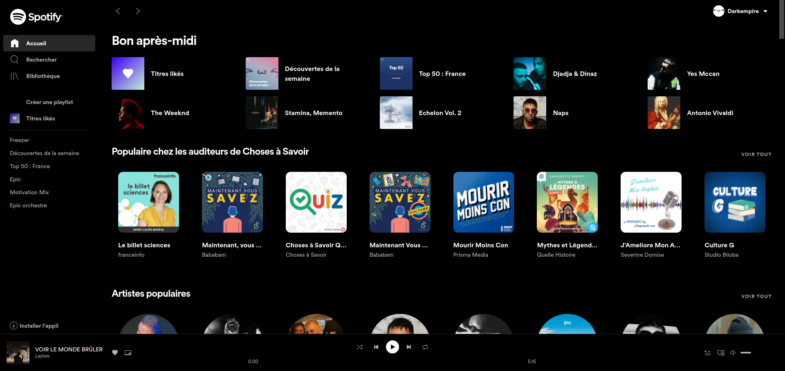
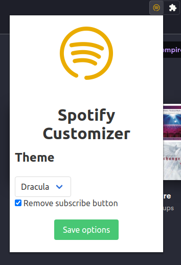

 

# Spotify Customizer

Chrome extension to customize Spotify web client. 

## Theme Preview

### Dracula theme

### Amoled theme

## Installation

**CHROME**
* Download the repository
* Go to `chrome://extensions/`
* Enable the `Developer Mode`
* Click on `Load unpacked`
* Select the repository folder

## Features
* Remove subscribe button
* Change the theme

## Options
You can click on the extension icon

## Create a new theme

You can easily create a new theme.

1. Create a new css file in the `themes` folder (you can check other themes to create your new theme)
2. Add the theme in the `options.html` file
3. Create a Pull Request

## Discord

Join the Discord server !

## Contributing

Pull requests are welcome. For major changes, please open an issue first to discuss what you would like to change.

Please make sure to update tests as appropriate.

## License

This project is under [GPLv3](LICENSE).
